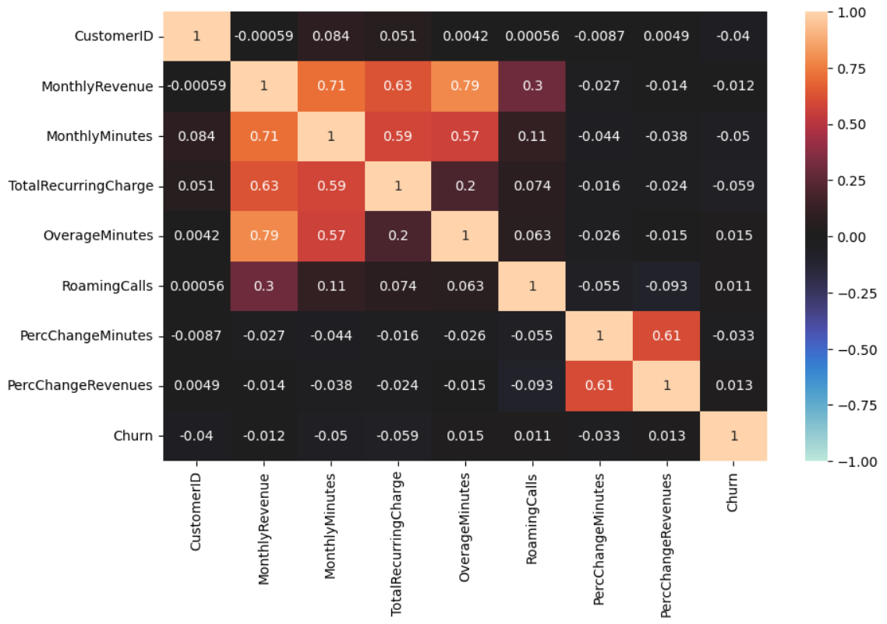
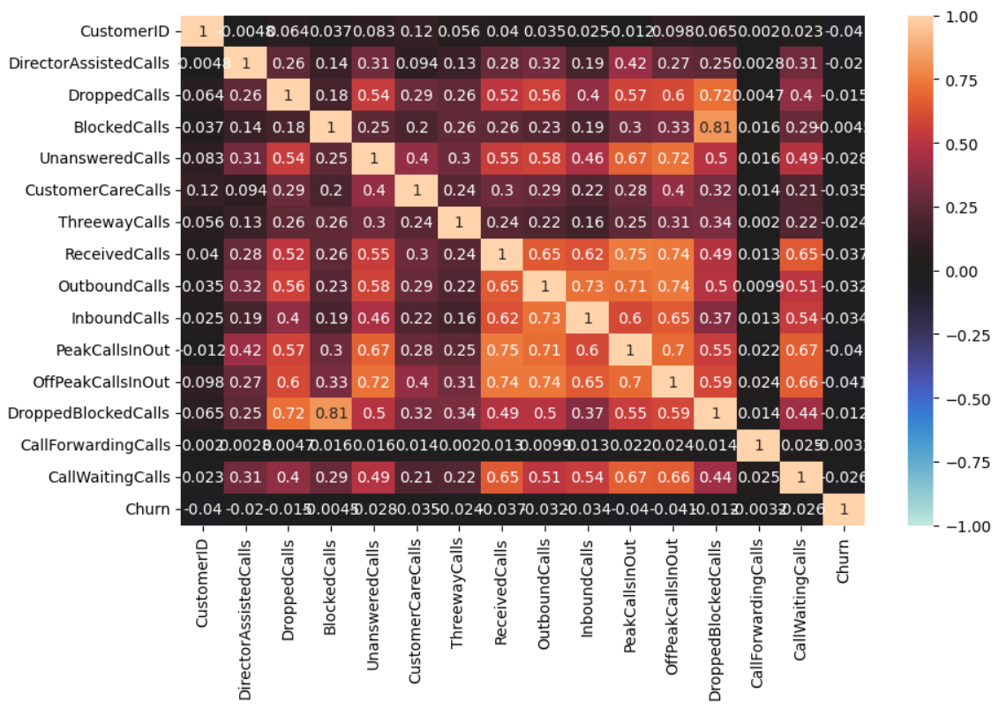
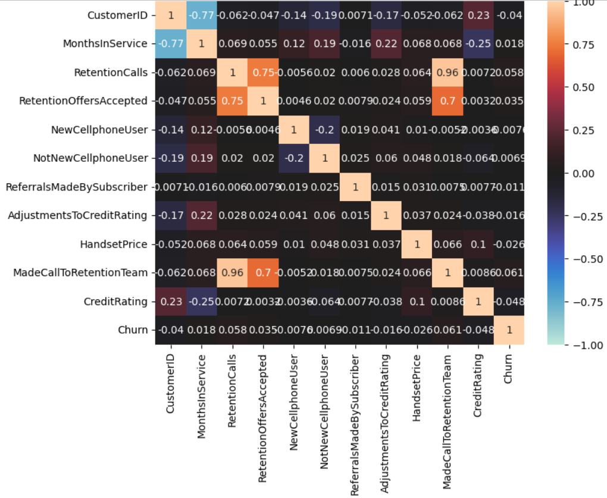
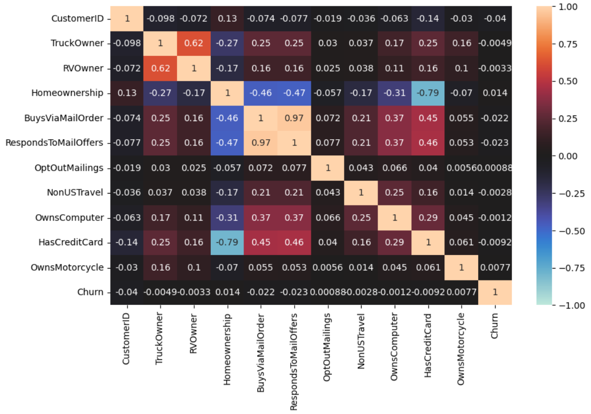
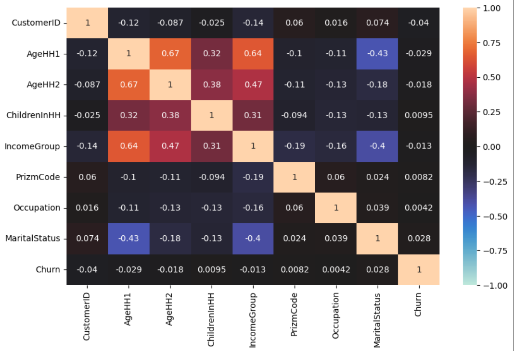
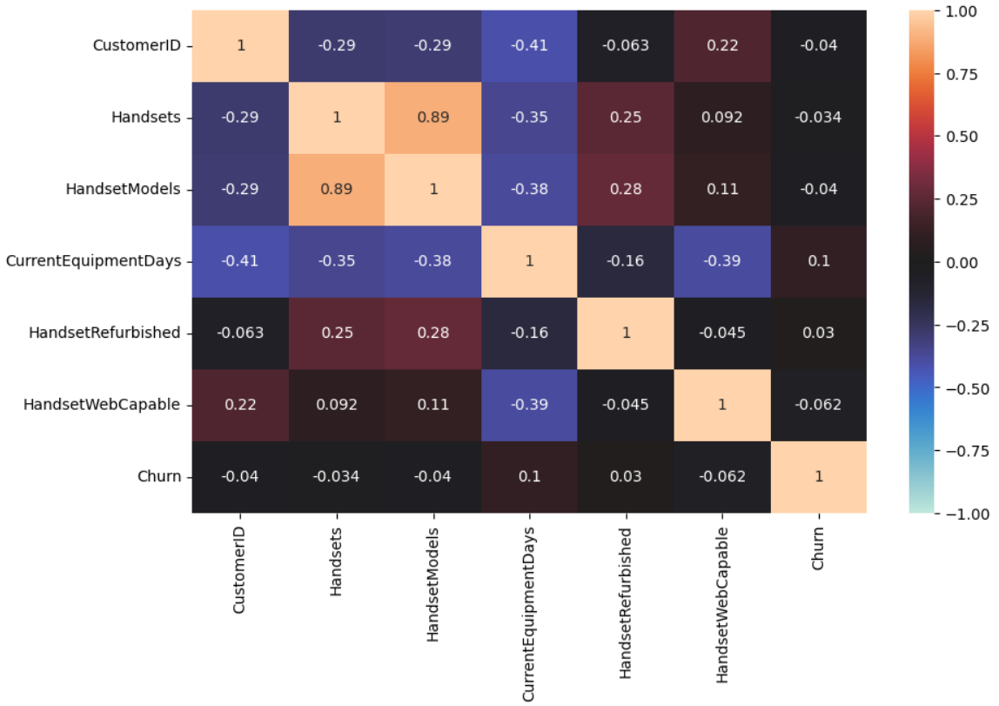
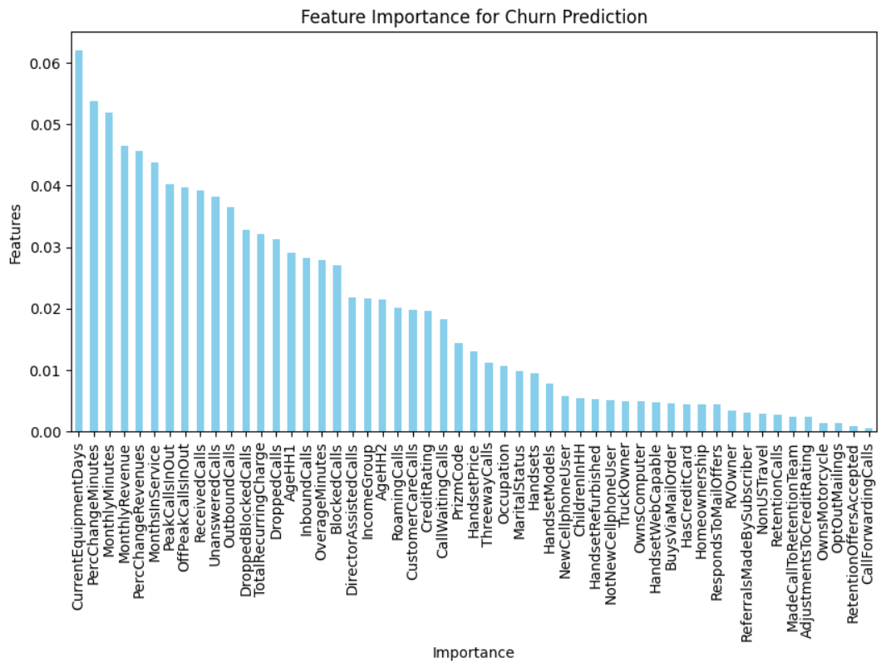

# SKN07-2nd-4Team 

> **팀원 : 김성근, 대성원, 유수현, 윤정연, 정승연**
</br>

<div align="center">
  <h2><strong> 📞 통신사 이용 고객 이탈 예측 📞 </h2></strog>
  2024.12.16 ~ 2024.12.17 
</div>
<br><br>
<div align="center">
    <div>
        
        
        
        
        
        
        <br/>
        
        
        
    </div>
</div>
<br><br>
    
---
<br>

### 1. 프로젝트 개요 
이 프로젝트는 통신사의 고객 데이터를 기반으로, 고객의 이탈(Churn)을 예측하는 모델을 개발하는 것입니다.
고객 이탈 예측은 비즈니스의 핵심 문제 중 하나로, 고객을 유지하는 것이 수익성에 큰 영향을 미칩니다.
고객이 이탈할 가능성을 예측하는 모델을 구축하여, 통신사는 이탈 가능성이 높은 고객을 사전에 식별하고, 그에 맞는 마케팅 전략을 통해 고객을 유지할 수 있게 됩니다.

</br>

### 2. 프로젝트 배경 
- 고객 이탈 문제
통신사와 같은 서비스 기반 기업에게 고객 이탈은 중요한 경영 문제입니다. </br>
고객이 서비스를 중단하거나 경쟁사의 서비스로 이동하면, 기업은 수익 감소는 물론, 새로운 고객을 유치하기 위한 마케팅 비용이 급증하게 됩니다. </br>
고객 이탈을 예측하는 능력을 강화하면, 기업은 더욱 효과적으로 고객을 유지할 수 있으며, 이를 통해 고객 충성도를 높이고 수익성을 개선할 수 있습니다.

- 고객 이탈 데이터 분석의 필요성
과거의 고객 데이터를 분석하여 고객의 이탈 패턴을 파악하는 것이 필요합니다.</br>
고객의 나이, 사용 기간, 서비스 이용 패턴, 요금제 등 다양한 특성을 바탕으로 이탈 예측 모델을 개발할 수 있습니다.</br>
데이터 분석을 통해 고객의 행동을 이해하고, 이탈을 방지할 수 있는 전략을 세울 수 있으며, 맞춤형 고객 관리가 가능해집니다.
</br>

### 3. 프로젝트 목표 

고객 이탈 예측 모델 개발</br>
- 고객의 이탈 가능성을 예측할 수 있는 머신러닝 모델을 개발합니다.

활용 목표
- 모델을 통해 이탈 가능성이 높은 고객을 식별한 후, 고객 세분화를 통해 다양한 맞춤형 대응 및 맞춤형 마케팅 전략을 제시합니다.</br>
  예를 들어, 특정 연령대나 특정 요금제에서 이탈이 많다면 해당 그룹에 대한 특별한 혜택을 제공할 수 있습니다.
- 예측 모델을 통해 고객 이탈을 줄이고, 고객 유지율을 향상시키는 전략을 제시합니다.


</br>

### 4. 프로젝트 과정
 (1) Dataset 준비
 > Telecom Churn : 13.37MB
 <br>dtypes: float64(26), int64(9), object(23)
 <br>RangeIndex: 51047 entries, 0 to 51046
 <br>Data columns : total 58 columns
 <br>Target : Yes(1) : No(0) = 1 : 4
 <br>출처 : Kaggle (https://www.kaggle.com/datasets/jpacse/datasets-for-churn-telecom/data?select=cell2celltrain.csv)

<br><br>

 (2) EDA
 >58개의 Column을 6개의 DataFrame으로 분리하여 Heatmap 시각화
 <br>
 
  
  
  
  
  
 <br>
 
<br><br>

 >Feature 중요도 순위에 따라 상위 40개 항목을 추출하여 훈련 데이터로 사용
 

<br><br>

 >상위 40개 항목 Column 정보 확인
 

<br><br>
 
 (3) 데이터 전처리 
 
▶ 결측치 제거 
``` python
df_all = train_file.dropna().copy()
df_all.isnull().sum()
```

 
<br><br>

  ▶ 라벨값(Churn) object --> int 변경 
``` python
churn_label = {'No': 0.0, 'Yes': 1.0} # 유지 0, 이탈 1
df_all['Churn'] = df_all['Churn'].map(churn_label)
df_all
```

<br><br>
  ▶ 라벨값(Churn) 비율 확인
``` python
import numpy as np
np.unique(df_all['Churn'], return_counts=True)
```


<br><br>
  ▶ 모델 훈련에 사용할 컬럼만 선택하여 x_data,y_data 생성
``` python
 # 상관 계수가 높은 컬럼을 선택
 X_data = df_all[['CustomerID','MonthlyRevenue','MonthlyMinutes','TotalRecurringCharge','OverageMinutes','RoamingCalls','PercChangeMinutes','PercChangeRevenues','MonthsInService','RetentionCalls','RetentionOffersAccepted','NewCellphoneUser','NotNewCellphoneUser','ReferralsMadeBySubscriber','AdjustmentsToCreditRating','MadeCallToRetentionTeam','CreditRating','PeakCallsInOut','OffPeakCallsInOut','ReceivedCalls','UnansweredCalls','OutboundCalls','DroppedBlockedCalls','DroppedCalls','InboundCalls','BlockedCalls','DirectorAssistedCalls','CustomerCareCalls','CallWaitingCalls','CurrentEquipmentDays','HandsetRefurbished','IncomeGroup','PrizmCode','Occupation','MaritalStatus','HandsetModels','AgeHH1','ChildrenInHH','HandsetPrice','ThreewayCalls','Handsets']].copy()

# 이탈율
y_data = df_all['Churn']
```

<br><br>
 ▶ One-Hot 인코딩 
``` python
    # one-hot 인코딩 
    if 'PrizmCode' in df_file.columns:
        df_file = pd.get_dummies(df_file, columns=['PrizmCode'],drop_first=False)
    if 'Occupation' in df_file.columns:
        df_file = pd.get_dummies(df_file, columns=['Occupation'],drop_first=False)
    if 'MaritalStatus' in df_file.columns:
        df_file = pd.get_dummies(df_file, columns=['MaritalStatus'],drop_first=False)
    
    # Unknown -> -1 , 나머지는 숫자로 형 변환
    def label_handset_price(value):
        if value == 'Unknown':
            return -1  # Unknown 값을 -1로 라벨링
            # return np.nan  # Unknown 값을 NaN으로 처리 (XGBoost사용)
        else:
            return int(value)  # 나머지는 숫자로 변환
    if df_file['HandsetPrice'].dtype == 'object':
        df_file['HandsetPrice'] = df_file['HandsetPrice'].apply(label_handset_price)

    return df_file
```

<br><br>

 (4) 모델링 
 
 ▶ 데이터셋 분리
``` python
X_train, X_test, y_train, y_test = train_test_split(X_data, y_data, test_size=0.2, random_state=42)
```
<br>

 ▶ 모델 훈련
 #### ✔ Machine Learning

``` python
# 모델 정의
models = {
    "Logistic Regression": LogisticRegression(),
    "Decision Tree": DecisionTreeClassifier(),
    "Random Forest": RandomForestClassifier(class_weight='balanced'),
    "Gradient Boosting": GradientBoostingClassifier(),
    "XGBoost": XGBClassifier(learning_rate=0.1, max_depth=4, n_estimators=100),
    "SGDClassifier": SGDClassifier(loss='hinge'),
    "KNN": KNeighborsClassifier()
}

# Stratified K-Fold 설정
skf = StratifiedKFold(n_splits=5, shuffle=True, random_state=42)
# NumPy 배열로 변환 
X_resampled = X_resampled.to_numpy() if isinstance(X_resampled, pd.DataFrame) else X_resampled
y_resampled = y_resampled.to_numpy() if isinstance(y_resampled, pd.Series) else y_resampled

# 모델 훈련 및 평가
results = {}
for name, model in models.items():
    print(f"Model: {name}")
    fold_accuracies = []
    fold_roc_aucs = []

    for train_idx, val_idx in skf.split(X_resampled, y_resampled):
        if name in ["Decision Tree", "Random Forest", "Gradient Boosting", "XGBoost"]:
            X_fold_train, X_fold_val = X_resampled[train_idx], X_resampled[val_idx]
        else:
            X_fold_train, X_fold_val = X_train_scaler[train_idx], X_train_scaler[val_idx]

        y_fold_train, y_fold_val = y_resampled[train_idx], y_resampled[val_idx]
        
        model.fit(X_fold_train, y_fold_train)
        y_preds = model.predict(X_fold_val)
        y_probs = model.predict_proba(X_fold_val)[:, 1] if hasattr(model, "predict_proba") else None
        
        acc = accuracy_score(y_fold_val, y_preds)
        roc_auc = roc_auc_score(y_fold_val, y_probs) if y_probs is not None else None
        fold_accuracies.append(acc)
        if roc_auc is not None:
            fold_roc_aucs.append(roc_auc)
```
<br>

▶ 모델 성능 개선
``` python
# 튜닝을 위한 공통 부분 작성 (위와 중복되는 부분 있음)
from sklearn.ensemble import RandomForestClassifier
from sklearn.ensemble import GradientBoostingClassifier
from xgboost import XGBClassifier
from sklearn.metrics import accuracy_score, roc_auc_score
from imblearn.over_sampling import SMOTE
from sklearn.model_selection import train_test_split

X_train, X_test, y_train, y_test = train_test_split(X_data, y_data, test_size=0.2, random_state=42)

# 불균형 데이터 처리
sm = SMOTE(random_state=42)
X_resampled, y_resampled = sm.fit_resample(X_train, y_train)

# NumPy 배열로 변환

# 교차검증 
skf = StratifiedKFold(n_splits=5, shuffle=True, random_state=42)

# 학습 및 평가 함수
def go_train(select_model,model_name):
    accuracies = []
    roc_aucs = []

    # 교차검증 
    for train_idx, val_idx in skf.split(X_resampled, y_resampled):
    
        # 교차검증용 훈련 세트와 검증 세트 분리

        # 모델 학습 
        select_model.fit(X_train, y_train)

        # 검증 세트 평가
        y_val_pred = select_model.predict(X_val)
        y_val_prob = select_model.predict_proba(X_val)[:, 1]
        accuracies.append(accuracy_score(y_val, y_val_pred))
        roc_aucs.append(roc_auc_score(y_val, y_val_prob))

    # 테스트 세트
    select_model.fit(X_resampled, y_resampled)  # 전체 훈련 데이터로 재학습
    y_test_pred = select_model.predict(X_test)
    y_test_prob = select_model.predict_proba(X_test)[:, 1]
    test_acc = accuracy_score(y_test, y_test_pred)
    test_roc_auc = roc_auc_score(y_test, y_test_prob)
```
</br>

#### ✔ Deep Learning

``` python
import torch
from torch.utils.data import DataLoader, TensorDataset

train_dataset = torch.utils.data.TensorDataset(torch.tensor( X_train, dtype=torch.float32).to('cuda:0'), 
                                               torch.tensor( y_train.to_numpy(), dtype=torch.float32).to('cuda:0'))
test_dataset  = torch.utils.data.TensorDataset(torch.tensor( X_test,  dtype=torch.float32).to('cuda:0'), 
                                               torch.tensor( y_test.to_numpy(), dtype=torch.float32).to('cuda:0'))

BATCH_SIZE = 32
train_loader = torch.utils.data.DataLoader(dataset=train_dataset, batch_size=BATCH_SIZE, shuffle=True)
test_loader = torch.utils.data.DataLoader(dataset=test_dataset, batch_size=BATCH_SIZE, shuffle=False)

class ChurnModel(nn.Module):
    def __init__(self, input_size):
        super(ChurnModel,self).__init__()
        self.fc1   = nn.Linear(input_size, 1024)
        self.fc2   = nn.Linear(1024, 1024)
        self.fc3   = nn.Linear(1024, 512)
        self.fc4   = nn.Linear(512, 512)
        self.fc5   = nn.Linear(512, 1)

    def forward(self, x):
        x = self.fc1(x)
        x = F.leaky_relu(x)
        x = self.fc2(x)
        x = F.leaky_relu(x)
        x = self.fc3(x)
        x = F.leaky_relu(x)
        x = self.fc4(x)
        x = F.leaky_relu(x)
        x = self.fc5(x)
        x = torch.sigmoid(x)

        return x

class ChurnModel2(nn.Module):
    def __init__(self, input_size):
        super(ChurnModel2,self).__init__()
        self.input_size = input_size

        self.fc1_1   = nn.Linear(input_size//3, 512)
        self.fc1_2   = nn.Linear(input_size//3, 512)
        self.fc1_3   = nn.Linear(input_size//3 + input_size%3, 512)

        self.fc2_1   = nn.Linear(512, 512)
        self.fc2_2   = nn.Linear(512, 512)
        self.fc2_3   = nn.Linear(512, 512)

        self.fc3   = nn.Linear(512 * 3, 256)
        # self.fc4   = nn.Linear(256, 64)
     
        self.fc5   = nn.Linear(256, 1)

    def forward(self, x):
        d_ = self.input_size//3
        x1 = x[:, :d_]
        x2 = x[:, d_:d_ *2]
        x3 = x[:, d_*2:]

        x1 = self.fc1_1(x1)
        x1 = F.leaky_relu(x1)
        x2 = self.fc1_2(x2)
        x2 = F.leaky_relu(x2)
        x3 = self.fc1_3(x3)
        x3 = F.leaky_relu(x3)

        x1 = self.fc2_1(x1)
        x1 = F.leaky_relu(x1)
        x2 = self.fc2_2(x2)
        x2 = F.leaky_relu(x2)
        x3 = self.fc2_3(x3)
        x3 = F.leaky_relu(x3)

        x4 = torch.cat((x1, x2, x3), dim=1)
        # print(x1.shape, x2.shape, x3.shape, x4.shape)
        
        x4 = self.fc3(x4)
        x4 = F.leaky_relu(x4)

        # x4 = self.fc4(x4)
        # x4 = F.leaky_relu(x4)
  
        x4 = self.fc5(x4)
        x4 = torch.sigmoid(x4)

        return x4

def train(model, train_loader, optimizer, loss_fn):
    model.train()
    total_acc, total_loss = 0, 0
    for X, y in train_loader:
        optimizer.zero_grad()
        preds = model(X)
        # display(preds, y)
        loss = loss_fn(preds, y.reshape(-1,1))
        loss.backward()
        optimizer.step()

        total_acc += ((preds>=0.5).float() ==  y.reshape(-1,1)).float().sum().item()
        total_loss += loss.item()*y.size(0)
        # print(f'total_loss = {total_loss}, total_acc={total_acc}')
    return total_acc/len(train_loader.dataset), total_loss/len(train_loader.dataset)

def evaluate(model, test_loader, loss_fn):
    model.eval()
    total_acc, total_loss = 0, 0

    with torch.no_grad():  
        for X, y in test_loader:
            preds = model(X)
            loss = loss_fn(preds, y.reshape(-1,1))

            total_acc += ((preds>=0.5).float() ==  y.reshape(-1,1)).float().sum().item()
            total_loss += loss.item()*y.size(0)

    return total_acc/len(test_loader.dataset), total_loss/len(test_loader.dataset)

num_epochs = 10

torch.manual_seed(1)

def learning(num_epochs,model, train_loader, test_loader, optimizer, loss_fn):
    for epoch in range(num_epochs):
        acc_train, loss_train = train(model, train_loader, optimizer, loss_fn)
        acc_valid, loss_valid = evaluate(model, test_loader, loss_fn)
        print(f'에포크 {epoch} 정확도: {acc_train:.4f} 검증 정확도: {acc_valid:.4f} \
            훈련 Loss: {loss_train:.4f} 검증 Loss: {loss_valid:.4f}')
    #     break

loss_fns = {'BCELoss': nn.BCELoss(), 
            'HingeEmbeddingLoss': nn.HingeEmbeddingLoss(), 
            'BCEWithLogitsLoss': nn.BCEWithLogitsLoss() }

models = {'ChurnModel' : ChurnModel(train_dataset[0][0].__len__()), 
          'ChurnModel2': ChurnModel2(train_dataset[0][0].__len__())}
for model_name, model in models.items():
    model.to('cuda:0')
    print(f'{"*"*20} {model_name} {"*"*20}')
    for fn_name, loss_fn in loss_fns.items():
        optimizer = torch.optim.Adam(model.parameters(), lr=0.001)
        print(f'{"-"*15} {fn_name} {"-"*15}')
        learning(num_epochs, model, train_loader, test_loader, optimizer, loss_fn)
```
<br><br>

### 5. 프로젝트 결과

<br>

**1) 모델 성능 평가**

<br>

각 모델의 성능은 교차 검증을 통해 검토되었으며, 주요 평가지표인 **정확도(Accuracy)** 와 **ROC-AUC** 를 기준으로 평가하였습니다.

<br>

**2) 모델링**

<br>

로지스틱 회귀(Logistic Regression), 결정 트리(Decision Tree), 랜덤 포레스트(Random Forest), 그래디언트 부스팅(Gradient Boosting), XGBoost 등 다양한 모델이 실험되었습니다.
* __로지스틱 회귀(Logistic Regression)__
  - Mean Accuracy: 0.7747339742435884
  - Mean ROC-AUC: 0.827727390454782
  
* **결정 트리(Decision Tree)**
  - Mean Accuracy: 0.7073191489624133
  - Mean ROC-AUC: 0.7073190731398483
  
* **랜덤 포레스트(Random Forest)**
  - Mean Accuracy: 0.8036210039245082
  - Mean ROC-AUC: 0.8715462593154809
  
* **그래디언트 부스팅(Gradient Boosting)**
  - Mean Accuracy: 0.7963334335743306
  - Mean ROC-AUC: 0.8556458031733211
  
* **XGBoost**
  - Mean Accuracy: 0.8003021013375582
  - Mean ROC-AUC: 0.8620662223104063

* **SGDClassifier**
  - Mean Accuracy: 0.7741193830961918
  - Mean ROC-AUC: N/A

* **KNN(K-최근접 이웃 알고리즘)**
  - Mean Accuracy: 0.7421592897541187
  - Mean ROC-AUC: 0.8078817540896164
    

각 모델의 결과는 고객 이탈을 예측하는 데 있어 **상당히 높은 정확도**를 기록했으며, 특히 **랜덤 포레스트**와 **XGBoost** 모델은 **ROC-AUC** 점수가 높게 나와, 모델의 **분류 성능**이 우수함을 확인했습니다.

<br>

**3) 모델 선택 및 결과 분석**

<br>

각 모델의 성능은 교차 검증을 통해 검토되었으며, 주요 평가지표인 **정확도(Accuracy)**, **ROC-AUC**를 기준으로 평가하였을때 가장 높은 점수가 나왔던 XGBoost 모델을 선택하여 결과를 분석하였습니다.

 

<br> 교차검증 Mean Accuracy: 0.8048
- 평균 **80.48**%의 정확도를 기록하며, 전체 모델 중에서 가장 높은 정확도를 보였습니다. 이는 모델이 고객 이탈 예측 문제에서 상당히 안정적인 성능을 보였다는 것을 의미합니다.
  
교차검증 Mean ROC-AUC: 0.8657
- 평균 **0.8657**의 ROC-AUC를 기록하였으며, 이는 이 모델이 이탈 예측에서 긍정적인 클래스(이탈 가능성이 높은 고객)와 부정적인 클래스(이탈하지 않은 고객)를 잘 구별하고 있다는 것을 의미합니다. 높은 ROC-AUC 값은 모델이 불균형 데이터에서 잘 작동하고 있다는 증거입니다.

Test Accuracy: 0.7201
- 테스트 데이터에서는 **72.01**%의 정확도를 기록하였으며, 이는 모델이 실제 데이터에 대해서도 꽤 좋은 성능을 보였음을 나타냅니다. 그러나 교차 검증에서 보였던 성능보다는 다소 낮은 결과로, 이는 과적합(overfitting) 문제나 테스트 데이터의 특성 차이 때문일 수 있습니다.

Test ROC-AUC: 0.6813
- 테스트 데이터에서 ROC-AUC는 **0.6813**을 기록했습니다. 이는 모델이 테스트 데이터에서도 어느 정도 구별 성능을 보였지만, 교차 검증에서의 성능보다는 낮은 결과입니다. 모델의 일반화 성능이 약간 부족할 수 있음을 시사합니다.

<br>


**4) 성능 분석 및 시사점**
- **XGBoost 모델**은 교차 검증에서 뛰어난 성능을 보였으나, 실제 테스트 데이터에서는 다소 성능이 떨어졌습니다. 이는 학습 데이터와 테스트 데이터 간의 차이, 또는 모델이 일부 과적합된 결과일 수 있습니다.
- **정확도**와 **ROC-AUC** 모두 꽤 우수한 결과를 나타내었고, 특히 ROC-AUC 지표는 이탈 예측 문제에서 모델의 성능을 더욱 잘 평가할 수 있는 지표로, XGBoost가 긍정적 클래스를 잘 구분하는 능력을 보여주었습니다.
- **모델의 향후 개선 방향**으로는, 과적합을 방지하기 위한 추가적인 하이퍼파라미터 튜닝, 테스트 데이터에 대한 성능 개선을 위한 피처 엔지니어링 및 데이터 샘플링 기법 적용 등을 고려할 수 있습니다.

<br>


### 6. 팀원 회고
김성근
>
>
대성원
> 
>
윤정연
> 
> 
유수현
>
>
정승연
>
>
<br>
