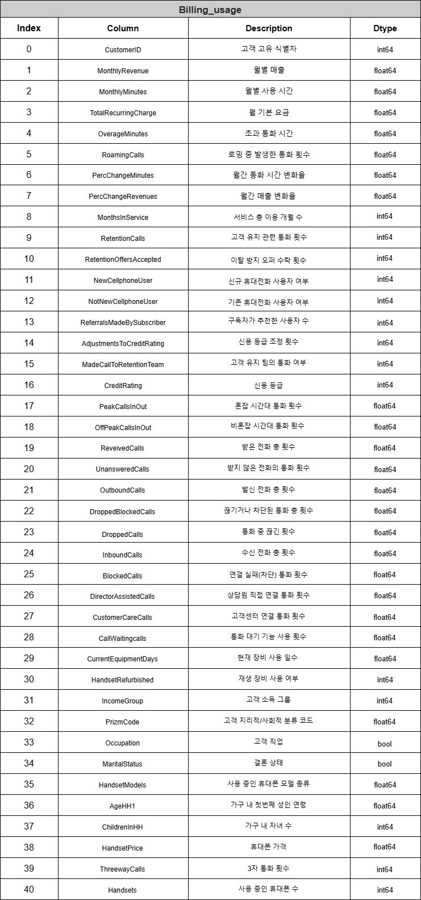

# SKN07-2nd-4Team 

> **팀원 : 김성근, 대성원, 유수현, 윤정연, 정승연**
</br>

<div align="center">
  <h2><strong> 📞 통신사 이용 고객 이탈 예측 📞 </h2></strog>
  2024.12.16 ~ 2024.12.17 
</div>
<br><br>
<div align="center">
    <div>
        
        
        
        
        <br/>
        
        
        
    </div>
</div>
<br><br>
    
---
<br>

### 1. 프로젝트 개요 
이 프로젝트는 통신사의 고객 데이터를 기반으로, 고객의 이탈(Churn)을 예측하는 모델을 개발하는 것입니다.
고객 이탈 예측은 비즈니스의 핵심 문제 중 하나로, 고객을 유지하는 것이 수익성에 큰 영향을 미칩니다.
고객이 이탈할 가능성을 예측하는 모델을 구축하여, 통신사는 이탈 가능성이 높은 고객을 사전에 식별하고, 그에 맞는 마케팅 전략을 통해 고객을 유지할 수 있게 됩니다.

</br>

### 2. 프로젝트 배경 
- 고객 이탈 문제
통신사와 같은 서비스 기반 기업에게 고객 이탈은 중요한 경영 문제입니다. </br>
고객이 서비스를 중단하거나 경쟁사의 서비스로 이동하면, 기업은 수익 감소는 물론, 새로운 고객을 유치하기 위한 마케팅 비용이 급증하게 됩니다. </br>
고객 이탈을 예측하는 능력을 강화하면, 기업은 더욱 효과적으로 고객을 유지할 수 있으며, 이를 통해 고객 충성도를 높이고 수익성을 개선할 수 있습니다.

- 고객 이탈 데이터 분석의 필요성
과거의 고객 데이터를 분석하여 고객의 이탈 패턴을 파악하는 것이 필요합니다.</br>
고객의 나이, 사용 기간, 서비스 이용 패턴, 요금제 등 다양한 특성을 바탕으로 이탈 예측 모델을 개발할 수 있습니다.</br>
데이터 분석을 통해 고객의 행동을 이해하고, 이탈을 방지할 수 있는 전략을 세울 수 있으며, 맞춤형 고객 관리가 가능해집니다.
</br>

### 3. 프로젝트 목표 

고객 이탈 예측 모델 개발</br>
- 고객의 이탈 가능성을 예측할 수 있는 머신러닝 모델을 개발합니다.

활용 목표
- 모델을 통해 이탈 가능성이 높은 고객을 식별한 후, 고객 세분화를 통해 다양한 맞춤형 대응 및 맞춤형 마케팅 전략을 제시합니다.</br>
  예를 들어, 특정 연령대나 특정 요금제에서 이탈이 많다면 해당 그룹에 대한 특별한 혜택을 제공할 수 있습니다.
- 예측 모델을 통해 고객 이탈을 줄이고, 고객 유지율을 향상시키는 전략을 제시합니다.


</br>

### 4. 프로젝트 과정
 (1) Dataset 준비
 > Telecom Churn : 13.37MB
 <br>dtypes: float64(26), int64(9), object(23)
 <br>RangeIndex: 51047 entries, 0 to 51046
 <br>Data columns : total 58 columns
 <br>Target : Yes(1) : No(0) = 1 : 4
 <br>출처 : Kaggle (https://www.kaggle.com/datasets/jpacse/datasets-for-churn-telecom/data?select=cell2celltrain.csv)

<br><br>

 (2) EDA
 >58개의 Column을 6개의 DataFrame으로 분리하여 Heatmap 시각화
 <br>
 
  
  
  
  
  
 <br>
 
<br><br>

 >Feature 중요도 순위에 따라 상위 40개 항목을 추출하여 훈련 데이터로 사용
 

<br><br>

 >상위 40개 항목 Column 정보 확인
 

<br><br>

 (3) 데이터 전처리 
 
<br><br><br>▶ 결측치 제거 
``` python
df_all = train_file.dropna().copy()
df_all.isnull().sum()
```

 

<br>▶ 라벨값(Churn) object -> int 변경 
``` python
churn_label = {'No': 0.0, 'Yes': 1.0} # 유지 0, 이탈 1
df_all['Churn'] = df_all['Churn'].map(churn_label)
df_all
```

<br>▶ 라벨값(Churn) 비율 확인
``` python
import numpy as np
np.unique(df_all['Churn'], return_counts=True)
```


<br>
 (4) 모델링 

 ▶ 모델 훈련에 사용할 컬럼만 선택하여 X,y 데이터 생성 및 인코딩
 ``` python
 # 상관 계수가 높은 컬럼을 선택
 X_data = df_all[['CustomerID','MonthlyRevenue','MonthlyMinutes','TotalRecurringCharge','OverageMinutes','RoamingCalls','PercChangeMinutes','PercChangeRevenues','MonthsInService','RetentionCalls','RetentionOffersAccepted','NewCellphoneUser','NotNewCellphoneUser','ReferralsMadeBySubscriber','AdjustmentsToCreditRating','MadeCallToRetentionTeam','CreditRating','PeakCallsInOut','OffPeakCallsInOut','ReceivedCalls','UnansweredCalls','OutboundCalls','DroppedBlockedCalls','DroppedCalls','InboundCalls','BlockedCalls','DirectorAssistedCalls','CustomerCareCalls','CallWaitingCalls','CurrentEquipmentDays','HandsetRefurbished','IncomeGroup','PrizmCode','Occupation','MaritalStatus','HandsetModels','AgeHH1','ChildrenInHH','HandsetPrice','ThreewayCalls','Handsets']].copy()

# 이탈율
y_data = df_all['Churn']

# object 타입 컬럼 확인 
X_data[X_data.select_dtypes(include=['object']).columns]

# object 타입 unique 값 확인 
print(f'NewCellphoneUser : {X_data.NewCellphoneUser.unique(),} \n\
NotNewCellphoneUser : {X_data.NotNewCellphoneUser.unique(),}  \n\
MadeCallToRetentionTeam : {X_data.MadeCallToRetentionTeam.unique(),} \n\
CreditRating : {X_data.CreditRating.unique(),} \n\
HandsetRefurbished : {X_data.HandsetRefurbished.unique(),} \n\
PrizmCode : {X_data.PrizmCode.unique(),} \n\
Occupation : {X_data.Occupation.unique(),}  \n\
MaritalStatus : {X_data.MaritalStatus.unique(),}  \n\
ChildrenInHH : {X_data.ChildrenInHH.unique(),} \n\
HandsetPrice : {X_data.HandsetPrice.unique()} ')
 ```


<br><br>

 (4) 모델링 \
 ▶ 데이터셋 분리
 1. 입력 데이터와 타겟 데이터로 분리
 2. 훈련 데이터셋과 테스트 데이터셋으로 분리
 3. 훈련 데이터셋과 테스트 데이터셋의 타겟 분포가 적절한지 확인

-------------------------------------

## Machine Learning
### 1. gradient_boosting_classifier 
``` python
 params = {
        "n_estimators": [10, 50, 100, 200, 300],  # 모델 생성 트리 개수
        "learning_rate": [0.1],                   # 학습률
        "max_depth": [1, 2, 3, 4, 5],             # 트리 최대 깊이
        "subsample": [0.5, 0.7],                  # sample rate
}

model = GradientBoostingClassifier()
model.fit(X_train_scaler, y_train)

#GridSearchCV 사용 (교차 검증을 통한 하이퍼파라미터 최적화)
grid_search = GridSearchCV(
    estimator=model,          
    param_grid=params,  
    scoring='accuracy',
    refit='accuracy',
    cv=5,             
    n_jobs=-1,         
)

grid_search.fit(X_train_scaler, y_train)

best_param_ = grid_search.best_params_
best_model = grid_search.best_estimator_ 
```

# 최적의 하이퍼파라미터 출력
print("Best Parameters:", best_param_)
print("Best models:", best_model)

y_preds = best_model.predict(X_test_scaler)
y_probs = best_model.predict_proba(X_test_scaler)[:, 1] if hasattr(best_model, "predict_proba") else None

2. logistic_regression
3. random_forest_classifier
4. xgb_classifier

</br>

### 5. 프로젝트 결과

</br>

**1) 모델 성능 평가**
각 모델의 성능은 교차 검증을 통해 검토되었으며, 주요 평가지표인 **정확도(Accuracy)**, **정밀도(Precision)**, **재현율(Recall)**, **F1 점수** 및 **ROC-AUC**를 기준으로 평가하였습니다.

</br>

**2) 모델링**
로지스틱 회귀(Logistic Regression), 결정 트리(Decision Tree), 랜덤 포레스트(Random Forest), 그래디언트 부스팅(Gradient Boosting), XGBoost 등 다양한 모델이 실험되었습니다.
- **로지스틱 회귀(Logistic Regression)**
  - 모델 결과: [모델 결과 삽입]
  
- **결정 트리(Decision Tree)**
  - 모델 결과: [모델 결과 삽입]
  
- **랜덤 포레스트(Random Forest)**
  - 모델 결과: [모델 결과 삽입]
  
- **그래디언트 부스팅(Gradient Boosting)**
  - 모델 결과: [모델 결과 삽입]
  
- **XGBoost**
  - 모델 결과: [모델 결과 삽입]


각 모델의 결과는 고객 이탈을 예측하는 데 있어 **상당히 높은 정확도**를 기록했으며, 특히 **랜덤 포레스트**와 **XGBoost** 모델은 **ROC-AUC** 점수가 높게 나와, 모델의 **분류 성능**이 우수함을 확인했습니다.

</br>
</br>

**3) 모델 선택 및 결과 분석**

</br>

각 모델의 성능은 교차 검증을 통해 검토되었으며, 주요 평가지표인 **정확도(Accuracy)**, **정밀도(Precision)**, **재현율(Recall)**, **F1 점수** 및 **ROC-AUC**를 기준으로 평가하였습니다.

(결과 캡쳐 사진)

- **정확도(Accuracy)**: 예시) 모델들이 대부분 **80% 이상의 정확도**를 보였으며, **고객 이탈 예측 문제**에서 상당히 **신뢰할 수 있는 예측 성능**을 나타냈습니다.</br>

- **정밀도(Precision)**와 **재현율(Recall)**: [결과 설명]

- **F1 Score**: [결과 설명]

- **ROC-AUC**: [결과 설명]

</br>


### 6. 팀원 회고
김성근
>
>
대성원
> 
>
윤정연
> 
> 
유수현
>
>
정승연
>
>
</br>
